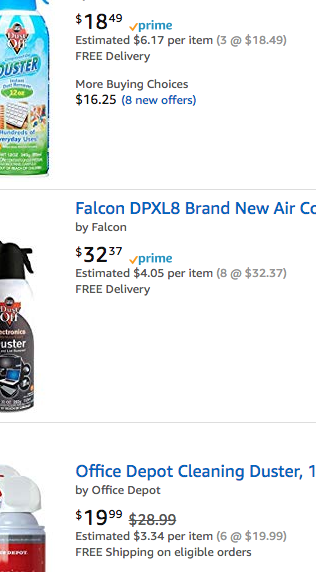
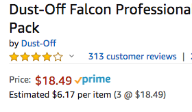

# Greasemonkey/Tampermonkey Scripts

This is my collection of GM scripts.

## 8 Tracks Hide Album Covers

This script will hide album covers with a gradient.
I developed this because some of the tracks I listen to have album covers that
may be offensive in a work environment (NSFW).

## Amazon Price Per Item

This script adds an estimated price per item. I say estimated because
the only way to know if the item is sold in a pack is by using hints based
on the title.

It will show the price on both the search and item details page.

